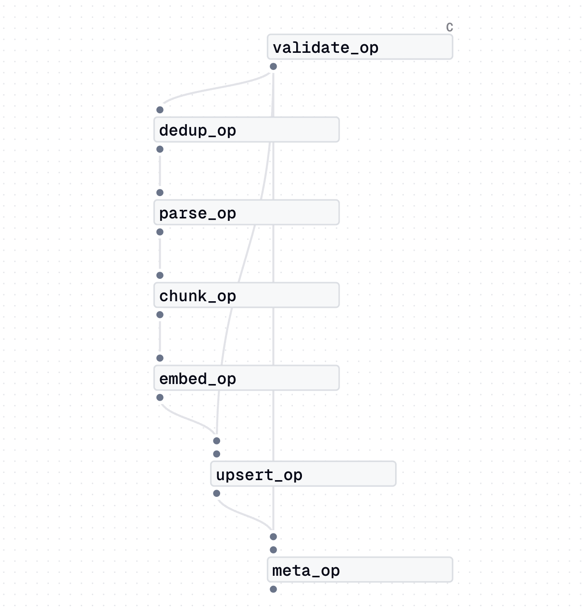

# Dagster Job Graph — ingest_job



## 그래프 읽는 법

Dagster 그래프의 선은 **실행 경로가 아닌 데이터 의존성(edge)** 을 나타낸다.
런타임에 특정 op이 출력을 생략하면 해당 op에 의존하는 모든 하위 op은 실행되지 않는다.
그래프는 정적(static)으로 생성되므로, 런타임 분기와 무관하게 항상 동일하게 그려진다.

## 파이프라인 흐름

```
validate_op → dedup_op → parse_op → chunk_op → embed_op → upsert_op → meta_op
```

| Op | 설명 | 조기 종료 조건 |
|---|---|---|
| `validate_op` | ETag 중복 체크, 파일 크기 검증 | 중복 ETag → 예외 발생 |
| `dedup_op` | `dedup_job.execute_in_process()` 호출 (simhash_op → verdict_op) | `needs_indexing=False` → `to_parse` 미발행 |
| `parse_op` | MinIO 다운로드 → LlamaIndex Document 생성 | — |
| `chunk_op` | Document → Node 청킹 | 청킹 결과 없음 → 예외 |
| `embed_op` | Dense + Sparse 임베딩 | — |
| `upsert_op` | Qdrant 업서트 | — |
| `meta_op` | Postgres 상태 갱신 (indexed) | — |

## 긴 선이 생기는 이유

`validate_op`의 `valid_config`가 `upsert_op`와 `meta_op`에 직접 전달되기 때문에
중간 op을 건너뛰는 긴 선이 그래프에 나타난다.

```python
valid_config = validate_op()
to_parse     = dedup_op(valid_config)
docs         = parse_op(to_parse)
...
result       = upsert_op(valid_config, vectors)  # validate → upsert 직접 연결
               meta_op(valid_config, result)     # validate → meta 직접 연결
```

런타임에는 `upsert_op`가 `vectors`도 필요하므로, `embed_op`가 실행되지 않으면
`upsert_op`와 `meta_op`도 실행되지 않는다. 즉 조기 종료 시 하위 op은 모두 스킵된다.
